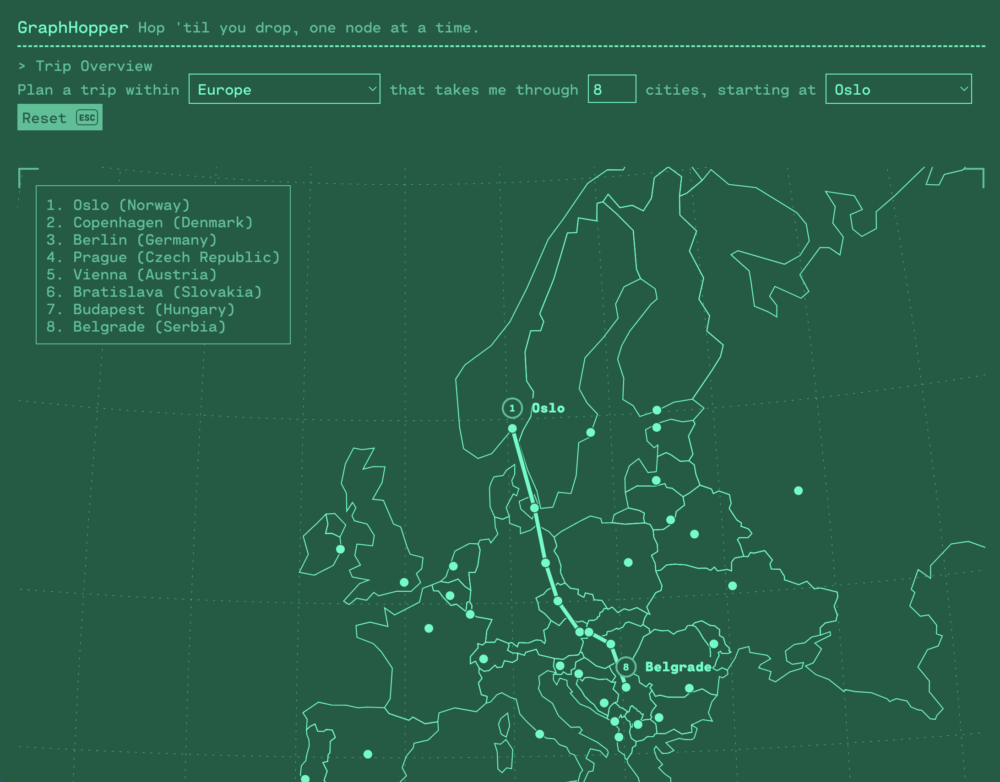

# GraphHopper

A GraphQL-powered travel planner.

> Hop 'til you drop, one node at a time.



* Front End Challenge by [Tom Hazledine](https://tomhazledine.com) for [Loft Orbital](https://loftorbital.com/).
* Assigned on 2023-07-27.
* [Requirements](./CHALLENGE.md)
* [Work Summary](./WORK_SUMMARY.md)

- [Overview](#overview)
- [Run the app](#run-the-app)


---

## Overview

GraphHopper is an SPA built using React (and React Router). Source code is located in the [./src](./src) directory, with JavaScript found in [./src/js](./src/js) and styles in [./src/scss](./src/scss).

The app is built using my hand-rolled "scaffold" scripts which include JS transpilation (via esbuild), SCSS compilation (sass/cssnano/postcss/autoprefixer), and a dev server. The scaffold scripts can be seen in [./scaffold](./scaffold) and are run from the package.json file. Basic configuration (app-name, dev server port, etc.) is defined in [./app.config.js](./app.config.js).

Assets and notes used for research and design are located in the [./research](./research) directory, and miscellaneous scripts and reference files are located in [./scratch](./scratch) (mostly used for mapping geo data to API data).

Key files:

* [./src/js/app.js](./src/js/app.js) - the main app component
* [./src/js/routes.js](./src/js/routes.js) - the app's routes
* [./src/js/components](./src/js/components) - functional components
* [./src/js/pages](./src/js/pages) - page components (including the master `<Layout>` component that wraps each page)
* [./src/js/utils](./src/js/utils) - the app's utility functions

Tests are co-located with the files they test, and are named with a `.test.js` suffix. The test suite is built using Jest and React Testing Library. The test suite can be run with `yarn test`.
## Run the app

If you're using Docker, you can run the app with:

```bash
docker-compose up
```

This will build the project and serve it at [http://localhost:1337](http://localhost:1337) (unless you've edited the `port` value of [./app.config.js](./app.config.js) or set a `PORT` environment variable, in which case it'll be served at that port instead).

If you prefer to run the project directly, you can do so using `yarn`:

```bash
yarn install
yarn dev
```

There are several commands available:

* `yarn dev` - run the app in development mode, watches for changes, and serves the app at [http://localhost:1337](http://localhost:1337)
* `yarn build` - build the app for production
* `yarn serve` - builds the app in development mode and serves it at [http://localhost:1337](http://localhost:1337)
* `yarn watch` - run the app in development mode, rebuilding on changes

> Note: the Dockerfile is configured to run `yarn dev` by default. In normal circumstances the container would build and run a production build of the app, but for the purposes of this challenge, it's more convenient to run the app in development mode.