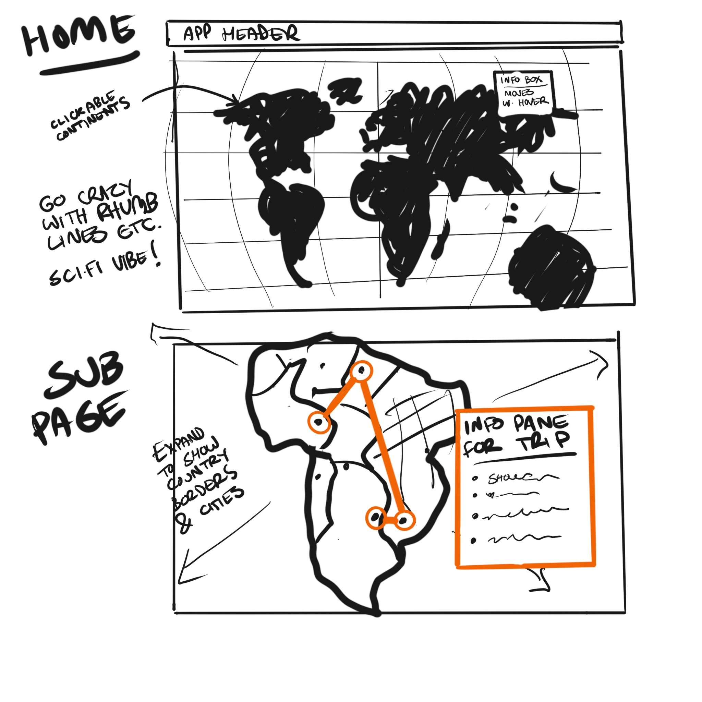
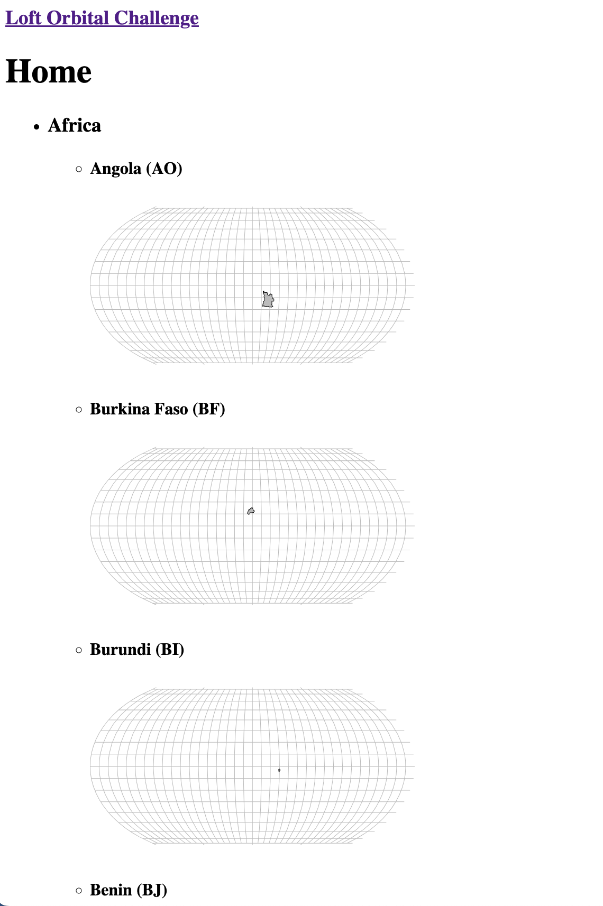
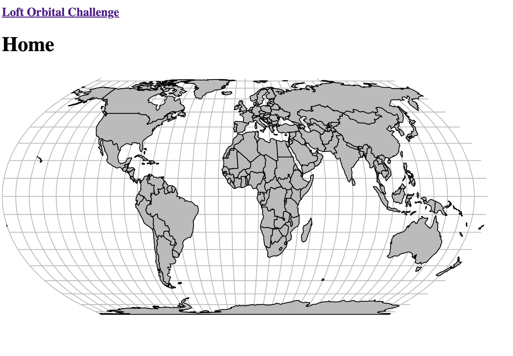

# Work Summary

The steps taken to build this app, in order.

## 1. Setup dev environment

-   Init my default "app scaffold" which I use to quickly bootstrap new projects; it's not comprehensive but I do know _exactly_ what's in it so it's good env for fast experimentation.
-   Setup `Dockerfile` and `docker-compose.yml` to run the app in a container.
-   Install Apollo Client and React Router to begin experimenting with the provided API.
-   Setup basic routing and app behaviour with React.
-   At this point I'm pretty sure the app will involve navigating to continents, so I add a placeholder `Continent` component and route, in addition to standard Home and Error pages.

Time: ~1 hour

## 2. Brainstorming

Gathering UI reference, generically thinking about the app, and making notes. Brainstorming documented in [./research/notes.md](./research/notes.md).

Time: ~1 week 😆

## 3. MVP development

-   Test API with calls to get `countries` and `continents`
-   Render shapes for countries:
    -   Use country-shape dataset (from [D3 geo example code](https://raw.githubusercontent.com/holtzy/D3-graph-gallery/master/DATA/world.geojson)) to add "shape" information to each country. This dataset does not exactly match the data returned by the API, so required some mapping. The script I used can be found in [scratch/mappings.js](./scratch/mappings.js) and can be run with `node scratch/mappings.js`. The resulting shape data is saved in  and the list of 75 "unmatched" countries can be found in [scratch/unmatched-countries.csv](./scratch/unmatched-countries.csv). These countries will be excluded from my app, but this is only due to the limits of the available data and the time constraints of the challenge.
    -   Rejigger the shape data to keep within the [geoJSON](https://geojson.org/) spec
    -   For each country within each continent, render an SVG map showing the country (with graticules and using a basic "EqualEarth" projection) .
    -   Render all countries into a single map view SVG, with `<g>` groups for each continent. .
    -   Change the map projection (experimented with several projections including "Interrupted Mollweide Hemispheres" and "Polyhedral Butterfly", but settled on an approximation of the Waterman Butterfly projection because it's visually unusual and I want to show that I'm a [map nerd](https://xkcd.com/977/)). Add highlighting on hover to indicate selected continent and country.
    -   Add keyboard support for world map interaction.
    -   Add click interaction for map to navigate to a continent page.
    -   For a continent page, load the data for that continent from the API.
    -   For a continent page, render a map of the continent (cropped to show *just* the continent using an appropriate projection - in this case, "Lagrangian" for consistency of rotation and aspect ratio).
    -   Add capital city markers to the continent map (with capitals' geoJSON taken from [github.com/Stefie/geojson-world](https://github.com/Stefie/geojson-world/blob/master/capitals.geojson) and parsed with `node scratch/capitals.js`)
    -   When clicking on a city, generate a trip order based on the distance between cities (using a naive "nearest neighbour" algorithm).
    -   Draw trip route on map.
