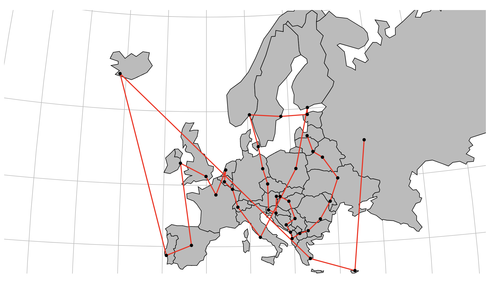
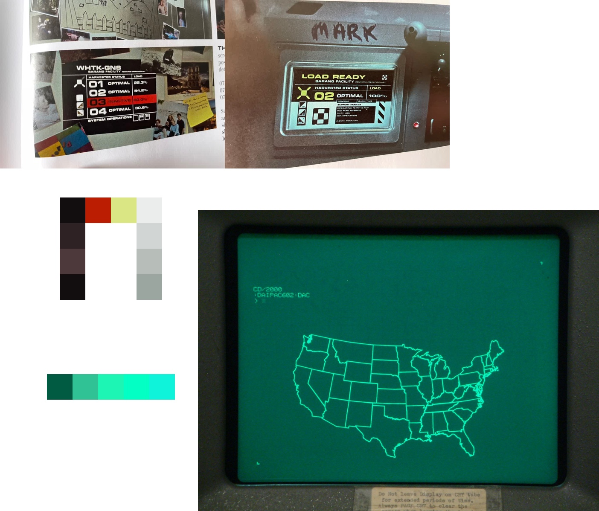
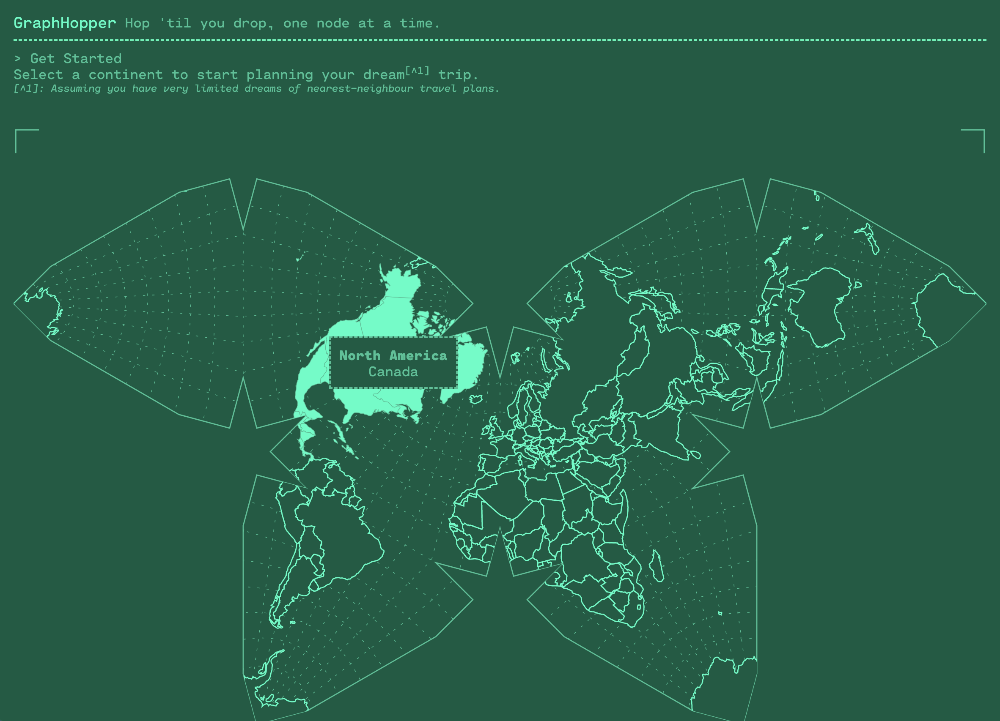

# Work Summary

The steps taken to build this app, in order.

## 1. Setup dev environment

-   Init my default "app scaffold" which I use to quickly bootstrap new projects; it's not comprehensive but I do know _exactly_ what's in it so it's good env for fast experimentation.
-   Setup `Dockerfile` and `docker-compose.yml` to run the app in a container.
-   Install Apollo Client and React Router to begin experimenting with the provided API.
-   Setup basic routing and app behaviour with React.
-   At this point I'm pretty sure the app will involve navigating to continents, so I add a placeholder `Continent` component and route, in addition to standard Home and Error pages.

Time: ~1 hour

## 2. Brainstorming

Gathering UI reference, generically thinking about the app, and making notes. Brainstorming documented in [./research/notes.md](./research/notes.md).

Time: ~1 week 😆

## 3. MVP development

-   Test API with calls to get `countries` and `continents`
-   Render shapes for countries:
    -   Use country-shape dataset (from [D3 geo example code](https://raw.githubusercontent.com/holtzy/D3-graph-gallery/master/DATA/world.geojson)) to add "shape" information to each country. This dataset does not exactly match the data returned by the API, so required some mapping. The script I used can be found in [scratch/mappings.js](./scratch/mappings.js) and can be run with `node scratch/mappings.js`. The resulting shape data is saved in  and the list of 75 "unmatched" countries can be found in [scratch/unmatched-countries.csv](./scratch/unmatched-countries.csv). These countries will be excluded from my app, but this is only due to the limits of the available data and the time constraints of the challenge.
    -   Rejigger the shape data to keep within the [geoJSON](https://geojson.org/) spec
    -   For each country within each continent, render an SVG map showing the country (with graticules and using a basic "EqualEarth" projection) .
    -   Render all countries into a single map view SVG, with `<g>` groups for each continent. .
    -   Change the map projection (experimented with several projections including "Interrupted Mollweide Hemispheres" and "Polyhedral Butterfly", but settled on an approximation of the Waterman Butterfly projection because it's visually unusual and I want to show that I'm a [map nerd](https://xkcd.com/977/)). Add highlighting on hover to indicate selected continent and country.
-   Add keyboard support for world map interaction.
-   Add click interaction for map to navigate to a continent page.
-   For a continent page, load the data for that continent from the API.
-   For a continent page, render a map of the continent (cropped to show *just* the continent using an appropriate projection - in this case, "Lagrangian" for consistency of rotation and aspect ratio).
-   Add capital city markers to the continent map (with capitals' geoJSON taken from [github.com/Stefie/geojson-world](https://github.com/Stefie/geojson-world/blob/master/capitals.geojson) and parsed with `node scratch/capitals.js`)
-   When clicking on a city, generate a trip order based on the distance between cities (using a naive "nearest neighbour" algorithm).
-   Draw trip route on map. 
-   Renaming the app (thanks to ChatGPT for the cheesy name suggestion!) and adding some instructional text to the homepage.
-   Add "trip overview" component to show details of selected trip.

Time: ~5 hours

## 4. Theming

-   Add basic styling to the app using reference from cathode-ray-tube monitors and vintage air traffic control systems. (see reference images in [./research/images/maps](./research/images/maps) and colour theme generation in [./research/images/maps/colourscheme.jpg](./research/images/maps/colourscheme.jpg)) . **Note: this is a departure from the original style research done in [Section 2: Brainstorming](#2-brainstorming), but is a better fit for the vector-based display of the map data (and quicker to implement and get looking good).** 
-   Form elements for editing trip withing the trip overview component.
-   Change start-city-selection to be triggered by clicking anywhere on a country. Clicks can be less precise in general, but allows for greater precision when selecting cities that are close together (previous option relied on expanded "hit box" for each city, that *could* overlap and block each other).
-   Add legend and labels to Continent map.
-   Make countries transparent to preserve clickability but show off the graticules.
-   Clear trip with reset function (button and ESC key).
-   Experimented with zooming map view to better highlight trip route by changing the SVG viewbox (aborted because too confusing from UX standpoint, but kept experimental code in `zoom-in-on-trip` branch).

Time: ~3 hours

## 5. Testing and CI

-  Setup Jest testing framework.
-  Add unit tests for "trip" utility functions.

---

## Things to improve if I had more time

* Zoom in on trips (currently the map is always shows a full continent)
* Resolve geo-data source (there are geo-political aspects I'm not qualified to judge)
* Incorporate more options for route calculation: e.g. "same currency", "same languages spoken" etc.
* Either combine the geoJSON data with the API data or access the geoJSON data from an API rather than yoloing it with the [/src/js/data](./src/js/data) files.
* Consolidate the two map components into a single component - there's a lot of duplication between the two.
* Setup better state-management for trip data (most likely using a flux model with `useReducer` and `useContext` hooks).
* Better keyboard support for selecting items on the map (switch from tabbing to using the arrow keys, for instance).
* Resolve overlapping city markers for routes that are close together (the Caribbean is a good example of this - currently an illegible mess).
* Small screen layout (currently *no* thought has been given to mobile layout).