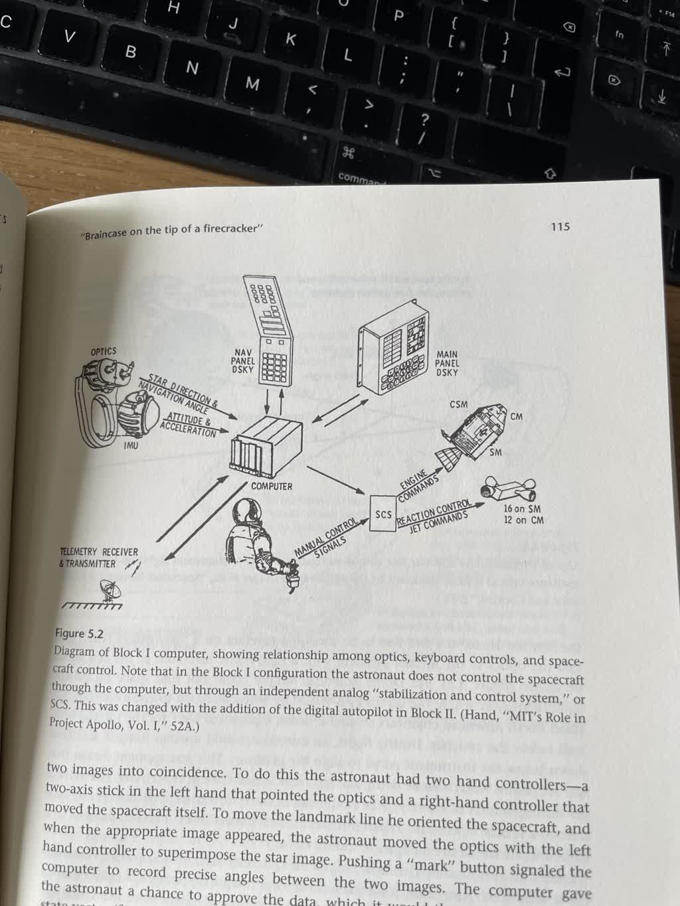
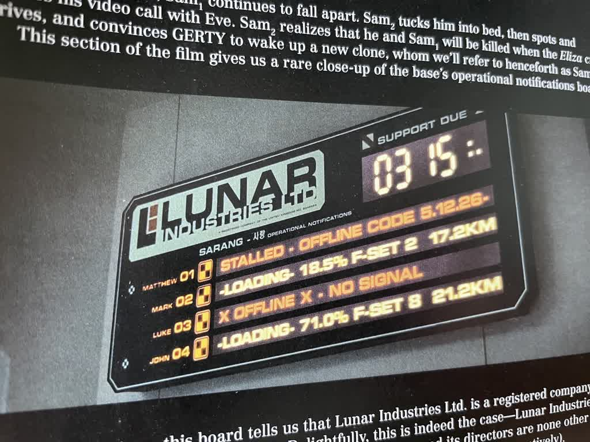
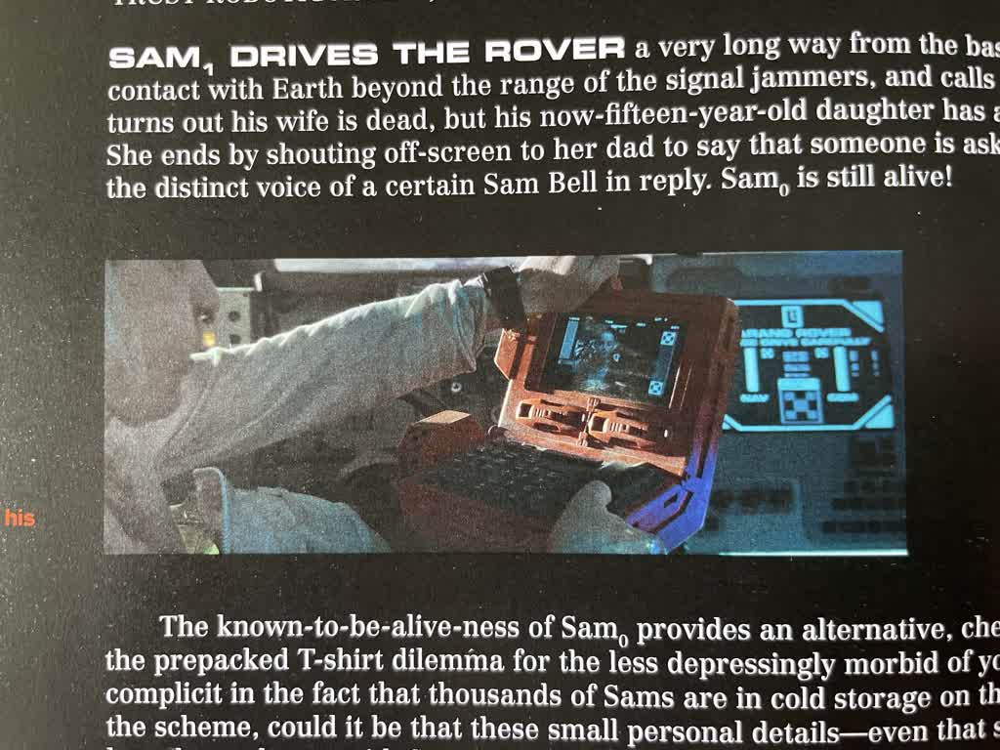

# Brainstorming

- [Overview](#overview)
- [General Idea](#general-idea)
- [Itenerary creation:](#itenerary-creation)
- [Rough wireframe sketch for MVP](#rough-wireframe-sketch-for-mvp)
- [Next steps:](#next-steps)
- [Reference Images](#reference-images)

## Overview

Given the nature of Loft Orbital's work, it seemed appropriate to style this project in the vein of a space mission control room. I've always been fascinated by the design of these rooms, and the way they've evolved over time. I've collected a few images of mission control rooms and related ephemera in the [./images](./images) directory (plus some sci-fi film UI reference) based on a couple of books I had handy. (see details in the bottom sections of this file).

## General Idea

* Geo-based UI, so a mapping/cartography vibe seems like a good fit.
* API returns `continents` and the `countries` for each continent, so a map of the world seems like a good place to start as a "homepage". Users could then click a continent to be shown a selection of itineraries for that continent?
  * Requires SVG map assets for each continent and country. Can I find this and map it to the API data without burning too much time?

## Itenerary creation:

This is "what the app is about", so probably deserves more thought than I'm giving it here. I'm deliberately focussing on a snazzy space-themed UI to show that I value UI work and am also a total nerd. *BUT* I will need iteneraries to fulfill the requirements of the challenge.

What does the API give me to work with? For each country, I get:

* name
* native (localised name)
* capital
* currency
* code
* awsRegion
* currencies (array of currency codes)
* emoji
* emojiU (unicode emoji)
* languages (array of langs, each with name and "native" localised name)
* phone (country code for phone numbers)
* phones (array of country codes for phone numbers)
* states (array of states, each with name and code)
* subdivisions (array of subdivisions, each with name and code)

Useful "links" for a trip itenerary:

* currency
* language

## Rough wireframe sketch for MVP

## Next steps:

[tasklist-01.md](./tasklist-01.md)

---

## Reference Images

A set of images of Apollo Flight Control taken from the Ars Technica article [Apollo Flight Controller 101: Every console explained](https://arstechnica.com/science/2019/12/apollo-flight-controller-101-every-console-explained/):

* 
* 
* 

---

Some phone snaps of illustrations taken from David Mindell's book [Digital Apollo](http://web.mit.edu/digitalapollo/), which is about the development of the Apollo Guidance Computer and the software that ran on it:

* 
* 
* 
* 
* 
* 
* 
* 
* 
* 
* 
* 

---

Some phone snaps of typography examples included in Dave Addey's [Typeset in the Future](https://typesetinthefuture.com/) book, which focuses on the typography of sci-fi movies but also includes a lot of "sci-fi UI":

* 
* 
* 
* 
* 
* 
* 
* 
* 
* 
* 
* 
* 
* 
* 
* 
* 
